#  I'm Oussama


**AI Engineering Student**  | **ENSIAS STUDENT**  | **Robotics Enthusiast** 

[](https://linkedin.com/in/oussamaelfaqyr)
[](mailto:oussamaelfaqyr@gmail.com)

</div>


---

##  Arsenal

### Languages


### Machine Learning & AI


### Data & Databases


### Frameworks & Tools


---

##  The 5-Year Vision



```mermaid
graph LR
    A[Now: AI Student] --> B[Next: Applied AI Engineer]
    B --> C[Future: AI × Robotics Specialist]
    C --> D[Goal: Systems Others Trust]
    
    style A fill:#1a1a2e
    style B fill:#16213e
    style C fill:#0f3460
    style D fill:#533483
```

**I'm building toward becoming an engineer who:**
-  Designs end-to-end AI systems
-  Understands real-world constraints
-  Bridges AI ↔️ Robotics
-  Explains decisions to anyone

---


##  Let's Connect

<div align="center">

[](https://linkedin.com/in/oussamaelfaqyr)
[](mailto:oussamaelfaqyr@gmail.com)

**Open to:** Collaborations  • AI Engineering Opportunities

</div>

---

<div align="center">

```
┌─────────────────────────────────────────────────────┐
│  "Good AI engineering isn't about using every tool  │
│   It's about choosing the right one for the job."   │
└─────────────────────────────────────────────────────┘
```

⭐ If my approach resonates with you, star some repos!

</div>
